# **Lord of the Rings - Mount Doom**
Developed by Paul Pfister


[Link to live site](https://lotr-doom-638e78e3e24d.herokuapp.com/)

## Introduction
Lord of the Rings - Mount Doom is a text-based story game where the player takes on the role of Frodo Baggins, the player can choose between 2 paths in the beginning of the game, and the player must navigate through the game by making choices that will affect the outcome of the game. The player must reach Mount Doom and destroy the One Ring to win the game.

## Contents
* [Project Goals](#project-goals)<br>
    * [For the user](#for-the-user)
    * [For the site owner](#for-the-site-owner)
* [User Experience](#user-experience)<br>
    * [Target audience](#target-audience)
    * [User requirements](#user-requirements)
    * [User Manual](#user-manual)
    * [User Stories](#user-stories)
* [Technical Design](#technical-design)
    * [Data Models](#data-models)
    * [Flowchart](#flowchart)
* [Features](#features)
    * [App Features](#app-features)
    * [Feature Ideas for future development](#feature-ideas-for-future-development)
* [Technologies Used](#technologies-used)
* [Deployment & Local Development](#deployment--local-development)
* [Testing](#testing)
    * [Validation](#validation)
    * [Manual Testing](#manual-testing)
    * [Automated Testing](#automated-testing)
    * [Bugs](#bugs)
* [Credits](#credits)

## Project Goals

### ...For the user
* Play a game that is understandable and works as expected.
* Play a game where you have some story line choices.
* To sign up with a new account.
* Log back in to an existing account.

### ...For the site owner
* Take the user by the hand and guide them through the game. - clear instructions.
* To test the user's ability to make decisions.
* To receive feedback from the user about the game.

## User Experience

### Target audience
Lord of the rings fans, that are willing to imagine some extras in the Frodo Baggin's journey to Mount Doom.

### User requirements
* A game that is understandable and works as expected.
* Log-in works as expected and incorrect details do not allow the user access to their account.
* GA win or a loss is communicated to the user

### User Manual
Click the dropdown to view the user manual:
<details>
<summary>User Manual</summary>

### Log in
When the program starts, the user will be prompted to:
* Enter their existing login.
* Sign up for a new account.
This choice is navigated by typing yes or no on the keyboard and pressing enter to submit. The credentials will then submitted or checked in the Google Sheets.

The user will then type in their details. The program will reject any incorrect or invalid details and the user will have to try again.

### Playing the game
After Log In or Sign Up, the user will be taken to the main menu. Here, the user can select the path he wants to take.
The Paths are:
1. The Path of the Ring
2. The Path of the Fellowship

#### Levels
The user will be presented with a question and if the user answers correctly, the user will see an ASCII Art Piece of happy Frodo. If the user answers incorrectly, the game ends immediatly and the user have to restart the game. 

### Completing the game
When answering all questions correctly, the user will be taken to the end of the game. The user will be presented with a message that they have completed the game and saved middle earth. Now the user can decide to play again.
</details><br>

### User Stories
#### As a first time user...
(1) Sign up with a username and for the game.
(2) To have some visual ASCII Art to help understanding the game
(3) To see a visual representation of the game.
(4) To be able to sign up with a new account.
(5) To be able to make mistakes and receive feedback.
(6) To receive a win or loss message at the end of the game.

#### As a returning user...
(7) Be able to log in with my username and password.
(8) Play a different path than before.
(9) To send feedback to the site owner about the game.

#### As the site owner...
(10) Ensure that all data entered by the user is validated so as not to break the program/create bad user experience.
(11) Ensure that all user actions are given feedback in the terminal so that users feel they know what to do next in the game.


## Technical Design

### Flowchart

A flowchart was created using [figma](https://www.figma.com/de/) to visualise the logic flow of the game.

<details>
    <summary>Flowchart</summary>
    <p>Dungeon Escape game logic:</p>
    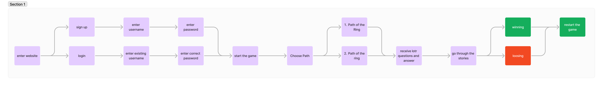
</details><br>

### Data Models

* The game uses a google sheet to store user login data - this is simple one.
* The game uses a JSON File to store the game story, questions and answers.

## Features
The website has a single page with several features within the mock python terminal. These features are listed below.

### App Features:

<details>
    <summary>Game Title</summary>
    <p>This is what the user sees upon loading the site. The ASCII Art piece was originally from [ASCII Art Archive](https://www.asciiart.eu/). I needed to modify it to suit this piece of Art into the PYthon Code</p>
    <ul>
        <li>
            <p>Are you an existing user? (yes/no)</p>
        </li>
        <li>
            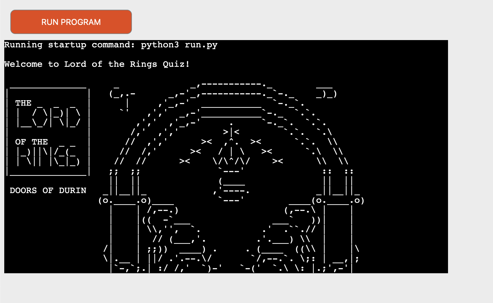
        </li>
        <li>
            <p>User story covered: 1, 2, 7</p>
        </li>
        <li>
            <p>Authentication - you cannot log in with an account that doesn't exist.</p>
        </li>
        <li>
            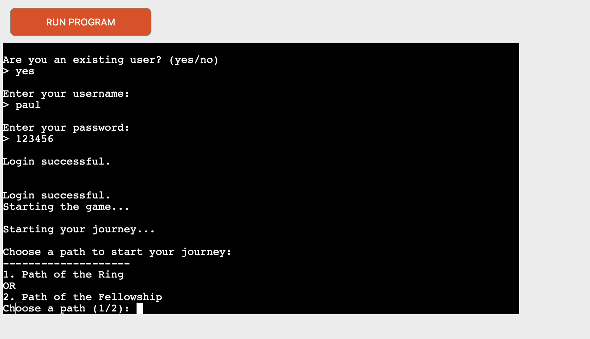
        </li>
        <li>
            <p>User story covered: 4, 7</p>
        </li>
        <li>
            <p>Validation - cannot sign up with invalid user data</p>
        </li>
        <li>
            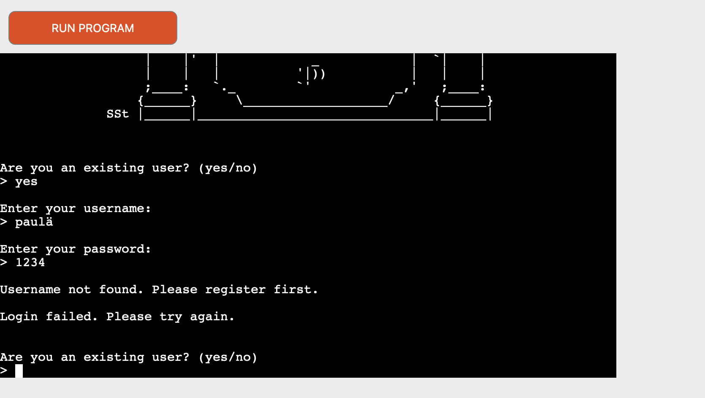
        </li>
        <li>
            <p>User story covered: 5</p>
        </li>
    </ul>
</details><br>

<details>
    <summary>Story game</summary>
    <p>This is what the user sees when started a path</p>
    <ul>
        <li>
            <p>There is a question highlighted green and 2 answers</p>
            <p>The user can choose between option a and b here</p>
        </li>
        <li>
            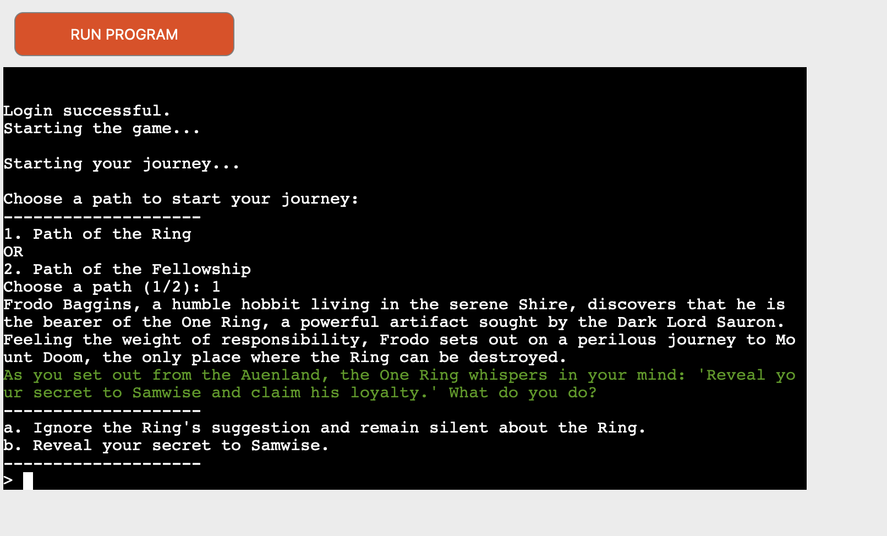
        </li>
        <li>
            <p>User story covered: 3, 6</p>
        </li>
</details><br>

<details>
    <summary>Question Challenge</summary>
    <p>This is what the user sees if the correct answer was typed - happy frodo and mount doom is in sight</p>
    <ul>
        <li>
            <p>A randomly generated multiplication question with 2 integers between 5 and 20.</p>
            <p>A Wrong answer leads to a loss of 1 life. A correct answer gains +20 bonus points.</p>
        <li>
            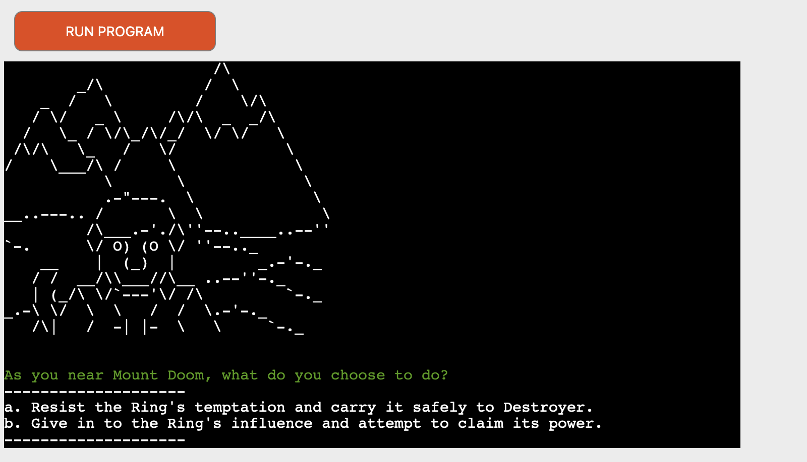
        </li>
        <li>
            <p>User story covered: 6</p>
        </li>
    </ul>
</details><br>

<details>
    <summary>End of the game</summary>
    <p>This is what the user sees if every answer was correct - the User reached Mount Doom</p>
    <ul>
        <li>
            <p>An ASCII Art where the user can see he saved the Shire and Frodo can go back home</p>
        <li>
            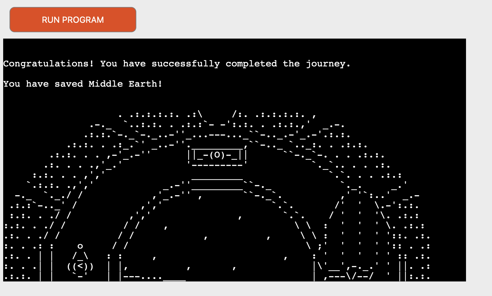
        </li>
        <li>
            <p>User story covered: 6</p>
        </li>
    </ul>
</details><br>


### Feature ideas for future development
* Add more paths to the game.
* Add more questions to the game.
* Add a leaderboard to the game.
* Add a timer to the game.
* Add a feature where the user can choose the difficulty of the game.

## Technologies Used
### Languages used
Python

### Other tools/websites/libraries used
* [figma](https://www.figma.com/de/) was used to create wireframes.
* [Git](https://git-scm.com/) was used for version control.
* [GitHub](https://github.com/) was used for saving and storing files.
* [VS Code](https://code.visualstudio.com/) was the IDE used for writing and editing code.
* [Heroku](https://id.heroku.com/) was used as the hosting platform for this site.
* [amiresponsive](https://ui.dev/amiresponsive) was used to test the website across different screens.

#### 3rd party Python Libraries used
* [Gspread / Google Sheets API](https://github.com/burnash/gspread) was used to handle getting/sending data to the google sheet used in the project. This is also not a standard feature of python, so it was necessary to install it for the purposes of this project.
* [Google OAuth 2.0](https://google-auth.readthedocs.io/en/stable/reference/google.oauth2.credentials.html) was used to set up the connection between the project and the developers personal google account. This was necessary because access to a google account via a program is restricted for security reasons.
* [Colorama](https://pypi.org/project/colorama/) was used to add colour to the game for increased visual appeal. It was necessary to install this dependency since python does not have this feature as standard.
* [JSON](https://docs.python.org/3/library/json.html) was used to store the game data in a JSON file. This was necessary to install because python does not have this feature as standard.


## Deployment & Local Development
### Local Development
Tested and developed locally in VS Code. Tu run this game locally you have to store your credentials in an JSON file and store it in the root directory of the project. The JSON file should look like this:
```json
{
    "credentials": {
        "type": "service_account",
        "project_id": "your-project-id",
        "private_key_id": "your-private-key-id",
        "private_key": "your-private-key",
        "client_email": "your-client-email",
        "client_id": "your-client-id",
        "auth_uri": "your-auth-uri",
        "token_uri": "your-token-uri",
        "auth_provider_x509_cert_url": "your-auth-provider-x509-cert-url",
        "client_x509_cert_url": "your-client-x509-cert-url"
    }
}
```
For Security reasons you should not store your credentials in a JSON file. Include in your .gitignore file the JSON file to prevent it from being pushed to your repository.

### Deployment
The website was deployed to [Heroku](https://id.heroku.com/)
To deploy the website to Heroku, follow these steps:
1. Create a new app on Heroku.
2. Connect the app to your GitHub repository.
3. Enable automatic deployment.
4. Deploy the app.

You also need to set your credentials for the Google Sheet API in the Heroku Environment Variables. You can do this by going to the settings tab of your Heroku app and clicking on the "Reveal Config Vars" button. Here you can add your credentials as key-value pairs.

 
## Testing
### Debugging
The site was tested using the following browsers: 
* Google Chrome
* Mozilla Firefox

The site was tested on the following devices:
* Macbook Pro 16" 2023
* Oneplus 8

### Validation
#### PEP8 Python Validator (from Code Institute)
Code institute's own Python Linter [pep8](https://pep8ci.herokuapp.com/) was used to validate all Python code in this project.

All code passed with no errors apart from the run.py file where the line limit of 80 characters had to be exceeded to display the title. These were the only errors that were found in this file.

<details>
<summary>instructions.py</summary>
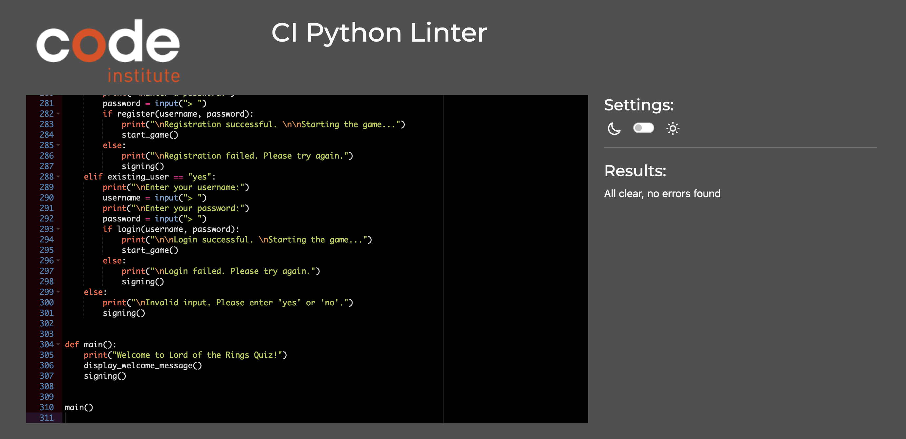
</details>
<br>

### Manual Testing

|User story|Feature|Test|Expected Result|Actual Result|
|---|---|---|---|---|
| 1. Sign up with a username and for the game. | Sign-up | When prompted by the opening view of the game, enter new details and hit 'enter' | Program accepts/signs user up. | Works as expected. |

<details>
    <summary>Screenshots</summary>
    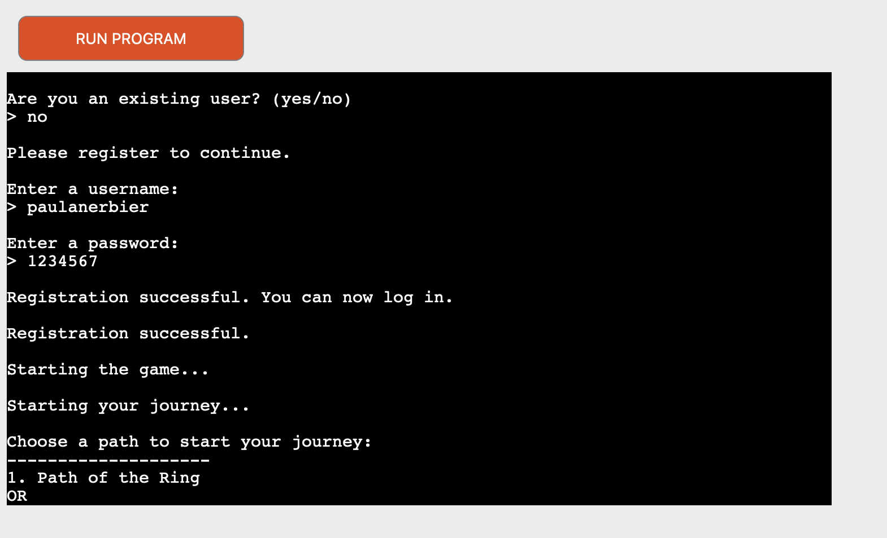<br>
</details><br>

|User story|Feature|Test|Expected Result|Actual Result|
|---|---|---|---|---|
| 2. To have some visual ASCII Art to help understanding the game | Main menu | Just look at it | Scroll down to see further instructions | Works as expected. |

<details>
    <summary>Screenshots</summary>
    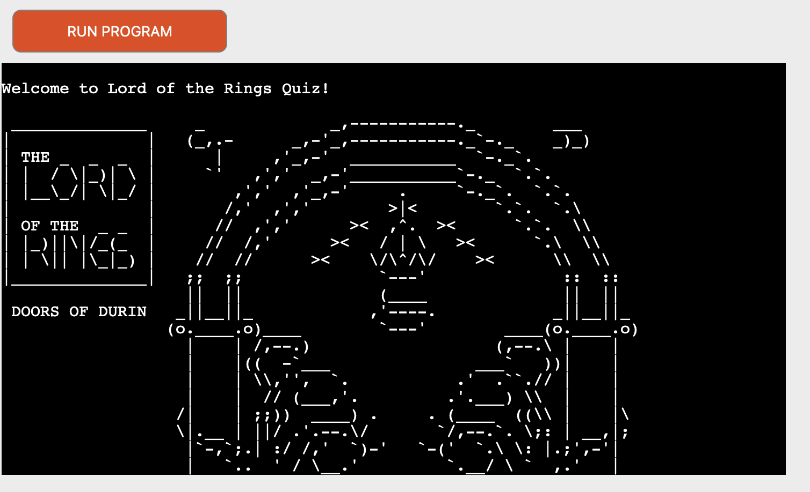<br>
</details><br>

|User story|Feature|Test|Expected Result|Actual Result|
|---|---|---|---|---|
| 3. To see a visual representation of the game. | Level view | When user starts the game, a view of the level appears clearly. | Program displays level, which is updated with each successful move the player makes | Works as expected. |

<details>
    <summary>Screenshots</summary>
    <br>
</details><br>

|User story|Feature|Test|Expected Result|Actual Result|
|---|---|---|---|---|
| 4. To be able to sign up with a new account. | Sign up prompt | When at the starting view, enter a response | Program flags this as an correct response. | Works as expected. |

<details>
    <summary>Screenshots</summary>
    <br>
</details><br>

|User story|Feature|Test|Expected Result|Actual Result|
|---|---|---|---|---|
| 5. To be able to make mistakes and receive feedback. | sign up validation | When entering a wrog prompt the program gives feedback and starts the question again | Program flags this as an incorrect answer and tells the user that  | Works as expected. |

<details>
    <summary>Screenshots</summary>
    <br>
</details><br>

|User story|Feature|Test|Expected Result|Actual Result|
|---|---|---|---|---|
| 6. To receive a win or loss message at the end of the game. | End game view | Completed the game | Program notifies user of their loss or win | Works as expected. |

<details>
    <summary>Screenshots</summary>
    <br>
</details><br>

|User story|Feature|Test|Expected Result|Actual Result|
|---|---|---|---|---|
| 7. Be able to log in with my username and password. | Login prompt | Logging in with your credentials | Program checks user and lets them access the game. | Works as expected. |

<details>
    <summary>Screenshots</summary>
    <br>
</details><br>

|User story|Feature|Test|Expected Result|Actual Result|
|---|---|---|---|---|
| 8. Play a different path than before. | Game Start | choose a different path | different questions ans different outcome | Works as expected. |

<details>
    <summary>Screenshots</summary>
    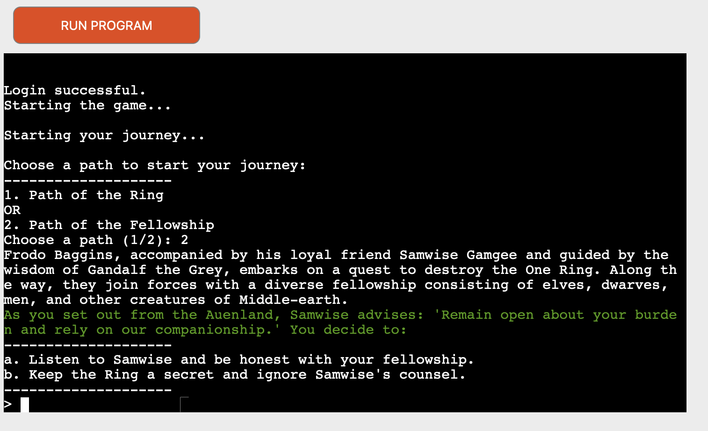<br>
</details><br>

|User story|Feature|Test|Expected Result|Actual Result|
|---|---|---|---|---|
| 9. Play a different game than before. | Level view | Start the game and complete a few levels. | Program has re-organised levels into a different order than before, and maths questions are different. | Works as expected. |

<details>
    <summary>Screenshots</summary>
    <br>
    <br>
</details><br>

|User story|Feature|Test|Expected Result|Actual Result|
|---|---|---|---|---|
|10. Ensure that all data entered by the user is validated so as not to break the program/create bad user experience. | validate input | When prompted wrong symbols the program tells you that | Giving the user feddback | Works as expected. |

<details>
    <summary>Screenshots</summary>
    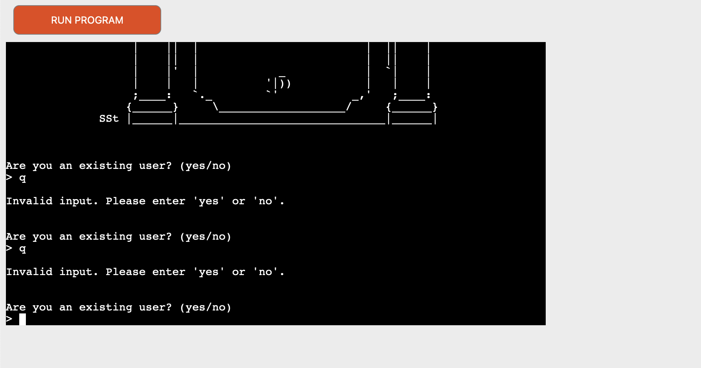<br>
</details><br>

|User story|Feature|Test|Expected Result|Actual Result|
|---|---|---|---|---|
| 11. Ensure that all user actions are given feedback in the terminal so that users feel they know what to do next in the game. | User Guide | Give clear instructions - what to do. | f.e. Choosing a path  | Works as expected |

<details>
    <summary>Screenshots</summary>
    <br>
</details><br>

### Bugs

| Bug Description  | Action Taken to Fix  |
|---|---|
|The user could sign up with empty username/password fields | I added condition to the validation function that catches empty strings. |
| ASCII Art was making a lot of problems, because you have to add an additional \ to show just one \ | So for every \ I made \\ out of it. |
| When the player typed anything else than a or b by answering the question the question was count as right | I added the missing if else statement that everytime the user inputs something else the game starts again. |

## Credits

### 3rd party code used

#### 3rd party Python libraries/modules
* [Gspread / Google Sheets API](https://github.com/burnash/gspread) was used to handle getting/sending data to the google sheet used in the project.
* [Google OAuth 2.0](https://google-auth.readthedocs.io/en/stable/reference/google.oauth2.credentials.html) was used to set up the connection between the project and the developers personal google account.
* [Colorama](https://pypi.org/project/colorama/) was used to add colour to the game for increased visual appeal.

### Acknowledgements
* Thanks to my Mentor Mo Shami for his guidance and support and for having the patience to help me with this project.
